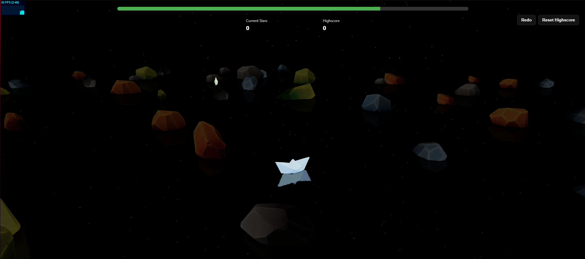

# Across The Ripple 

I came across GameOff 2025 in the middle of my university exams, so I decided to build a 3D game for the first time.  
What a better way to spend my time not studying, right? 

## Play 

[Play the Game Here](https://across-the-ripple.vercel.app)  

[itch.io/across-the-ripple](https://a56-a5.itch.io/across-the-ripple)

## Gameplay

Try to survive as long as possible.  
Your Boat sinks after 60s - collect stars to reset timer.  
Use Ripples to navigate your boat towards the nearest star. 

## Screenshots 

## Something else

Q. will i further update this?  
    - Maybe not.  
Q. Was it worth not studying for exams?  
    - Hell yeah!!